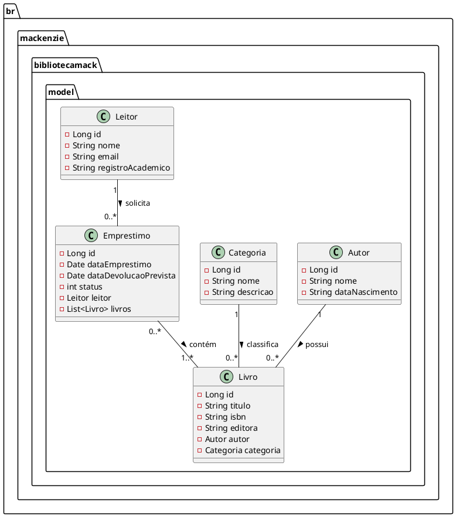
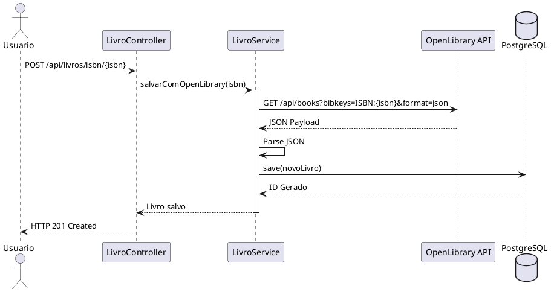

# Biblioteca Digital

Ana Julia - 10438692
Caroline Begiato - 10419181
Julia - 10426655

## Descrição
Projeto desenvolvido em Java com Spring Boot para gerenciamento de uma Biblioteca Digital.

O sistema permite cadastrar, listar, editar e excluir livros, autores, categorias, leitores e empréstimos. Também possui integração com a API Open Library para buscar informações de livros pelo ISBN.

## Tecnologias utilizadas
- Java 17
- Spring Boot
- Spring Data JPA
- Hibernate
- PostgreSQL
- Thymeleaf
- Maven
- Open Library API

## Como executar o projeto

# 1. Clone o repositório
git clone https://github.com/anajulia0911/PGS2_Biblioteca_Digital

# 2. Entre na pasta do projeto
cd PGS2_Biblioteca_Digital

# 3. Configure o banco de dados no arquivo:
# src/main/resources/application.properties

# Exemplo de configuração:
spring.datasource.url=jdbc:postgresql://localhost:5432/biblioteca_digital
spring.datasource.username=postgres
spring.datasource.password=sua_senha
spring.jpa.hibernate.ddl-auto=update

# 4. Execute o projeto
mvn spring-boot:run

# 5. Acesse no navegador
http://localhost:8080

## Funcionalidades
- Cadastro de livros
- Cadastro de autores
- Cadastro de categorias
- Cadastro de leitores
- Controle de empréstimos
- Busca de livros por ISBN
- Integração com Open Library
- Interface web com Thymeleaf
- API REST

## Principais endpoints

# Listar livros
GET /api/livros

# Buscar livro por ISBN na Open Library
GET /api/livros/preview/{isbn}

# Salvar livro usando ISBN
POST /api/livros/isbn/{isbn}

# Consulta agregada
GET /api/livros/agregado

# Excluir livro
DELETE /api/livros/{id}

## Estrutura do projeto

src/main/java
├── controller
├── service
├── repository
├── model
└── BibliotecaDigitalApplication.java

src/main/resources
├── templates
├── static
└── application.properties
## Diagrama de Classes


# Diagrama de Sequência no README

```markdown
## Diagrama de Sequência


## Como enviar para o GitHub

# Inicializar o Git
git init

# Adicionar os arquivos
git add .

# Criar o primeiro commit
git commit -m "Primeiro commit - Biblioteca Digital"

# Conectar ao repositório remoto
git remote add origin https://github.com/anajulia0911/PGS2_Biblioteca_Digital
# Enviar para o GitHub
git branch -M main
git push -u origin main

## Autor
Projeto desenvolvido para a disciplina de Programação de Sistemas II.
